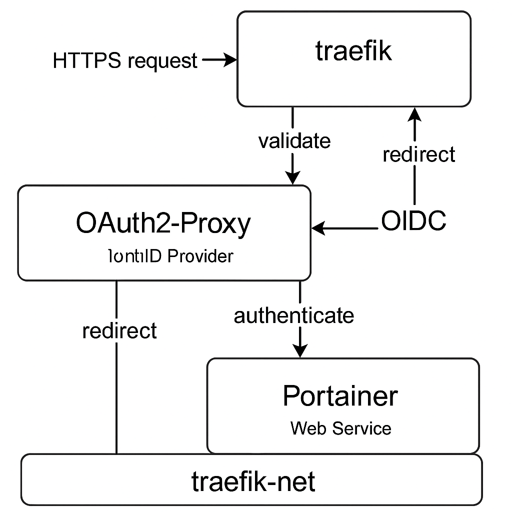

# 🔐 Exemple : Portainer sécurisé par Keycloak via Traefik + oauth2-proxy

Ce dépôt propose une stack Docker Compose **clés en main** pour sécuriser l'accès à **Portainer** à l'aide de :

- **Traefik** comme reverse proxy
- **Keycloak** comme fournisseur OpenID Connect (OIDC)
- **oauth2-proxy** pour la gestion des sessions et de l'authentification

---

## ⚙️ Technologies utilisées

- Docker / Docker Compose
- Traefik 3.x avec ACME (Let's Encrypt)
- Keycloak 22+ (OIDC)
- oauth2-proxy v7.6.0
- Cloudflare DNS API pour les certificats

---

## ⚠️ Prérequis

### ✅ Un domaine réel (ex: `example.com`)

Le domaine doit être géré chez Cloudflare.

### ✅ Un token API Cloudflare avec les permissions DNS

Créer un token ici : https://dash.cloudflare.com/profile/api-tokens

Permissions requises :
- Zone.Zone: Read
- Zone.DNS: Edit

---

## 🔐 Objectif

Protéger **Portainer** avec une authentification OIDC complète :

```
[Client] ─▶ [Traefik] ─▶ [oauth2-proxy] ─▶ [Keycloak] ─▶ [Portainer]
```

---

## 🚀 Démarrage rapide

### 1. Clone le dépôt

```bash
git clone https://github.com/ton-utilisateur/traefik-portainer-oidc-example.git
cd traefik-portainer-oidc-example
```

### 2. Renseigne `.env`

Renomme le fichier `.env.example` :

```bash
cp .env.example .env
```

Puis ajuste :
```env
DOMAIN=example.com
PORTAINER_HOSTNAME=portainer.example.com
OAUTH2_PROXY_HOSTNAME=auth-proxy.example.com
CLOUDFLARE_EMAIL=ton@email.com
CLOUDFLARE_API_TOKEN=token-avec-dns-access
KEYCLOAK_ADMIN_PASSWORD=changeme
OAUTH2_PROXY_COOKIE_SECRET=<généré avec openssl rand -base64 32>
```

### 3. Démarre la stack

```bash
docker compose up -d
```

🛠️ Keycloak sera automatiquement initialisé avec :
- Realm `homelab`
- Client `portainer`
- Utilisateur : `admin / changeme`

---

## 🌍 Certificats Let's Encrypt

Un **certificat wildcard** sera émis pour :

```
*.example.com
```

Traefik utilise le **DNS challenge Cloudflare**.

---

## 📂 Arborescence

```
.
├── docker-compose.yml
├── .env.example
├── keycloak-homelab-realm.json
├── keycloak-init.md
├── architecture.png
└── README.md
```

---

## 📷 Aperçu de l'architecture



---

## 📜 Licence

MIT — À utiliser pour vos homelabs, démos ou formations.
