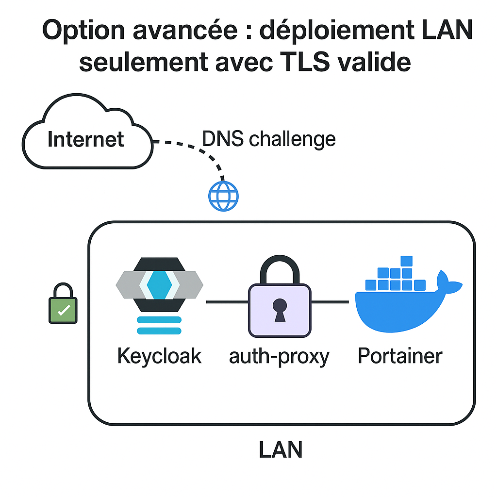

# 🔐 Exemple : Portainer sécurisé par Keycloak via Traefik + oauth2-proxy

Ce dépôt propose une stack Docker Compose **clés en main** pour sécuriser l'accès à **Portainer** à l'aide de :

- **Traefik** comme reverse proxy
- **Keycloak** comme fournisseur OpenID Connect (OIDC)
- **oauth2-proxy** pour la gestion des sessions et de l'authentification

---

## ⚙️ Technologies utilisées

- Docker / Docker Compose
- Traefik 3.x avec ACME (Let's Encrypt)
- Keycloak 22+ (OIDC)
- oauth2-proxy v7.6.0
- Cloudflare DNS API pour les certificats

---

## ⚠️ Prérequis

### ✅ Un domaine réel (ex: `example.com`)

Le domaine doit être géré chez Cloudflare.

### ✅ Un token API Cloudflare avec les permissions DNS

Créer un token ici : https://dash.cloudflare.com/profile/api-tokens

Permissions requises :
- Zone.Zone: Read
- Zone.DNS: Edit

### ✅ Création d'un réseau Docker partagé (utilisé par tous les services y faisant référence pour communiquer entre eux en toute sécurité via Traefik)

```bash
docker network create traefik-net
```

---

## 🧠 Option avancée : déploiement **LAN seulement** avec TLS valide

Tu peux sécuriser entièrement cette stack **sans exposer aucun port (80/443) sur Internet**, tout en conservant des certificats TLS valides de Let's Encrypt. Pour ce faire, on exploite la capacité du DNS challenge à vérifier la propriété du domaine **sans accès HTTP public**.



### ✅ Conditions requises

1. **Utilisation d’un DNS provider supportant les challenges DNS** (comme Cloudflare)
2. **Résolution DNS locale des sous-domaines**, par :

   - `/etc/hosts` :
     ```plaintext
     192.168.1.100 keycloak.local.example.com portainer.local.example.com auth-proxy.local.example.com
     ```
   - ou ton routeur/DNS local (Pi-hole, Unbound, etc.)

3. **Utilisation d’un sous-domaine réservé à l’usage interne**, comme `local.example.com`

   > 💡 En générant un certificat wildcard (`*.local.example.com`), tu peux sécuriser plusieurs services internes tout en isolant leur usage LAN. Cela t'évite de polluer le domaine principal.

### ✅ Avantages

- Pas besoin de rendre ton réseau accessible depuis Internet
- Certificats TLS toujours valides via ACME (Let’s Encrypt)
- Navigation sécurisée (https) avec des FQDN professionnels
- Authentification centralisée avec Keycloak

---

> 💡 Cette approche est idéale pour les environnements de test, homelabs sécurisés, ou tout déploiement sensible qui ne nécessite pas d’accès public.

---

### 📝 Fichier `.env`

Voici les variables essentielles à définir dans un fichier `.env` :

- `DOMAIN` → domaine utilisé pour générer un certificat wildcard ACME.  
  ⚠️ Il est **fortement recommandé d'utiliser un sous-domaine dédié à l’usage LAN**, par exemple : `local.example.com`.

- `PORTAINER_HOSTNAME`, `OAUTH2_PROXY_HOSTNAME` → préfixes utilisés pour générer les FQDN (`portainer.local.example.com`, etc.)

- `CLOUDFLARE_EMAIL`, `CLOUDFLARE_API_TOKEN` → identifiants de ton compte Cloudflare (avec accès DNS API)

- `KEYCLOAK_ADMIN_PASSWORD` → mot de passe admin Keycloak

- `OAUTH2_PROXY_COOKIE_SECRET` → généré avec :
  ```bash
  openssl rand -base64 32

---

## 🔐 Objectif

Protéger **Portainer** avec une authentification OIDC complète :

```
[Client] ─▶ [Traefik] ─▶ [oauth2-proxy] ─▶ [Keycloak] ─▶ [Portainer]
```

---

## 🚀 Démarrage rapide

### 1. Clone le dépôt

```bash
git clone https://github.com/ton-utilisateur/traefik-portainer-oidc-example.git
cd traefik-portainer-oidc-example
```

### 2. Renseigne `.env`

Renomme le fichier `.env.example` :

```bash
cp .env.example .env
```

Puis ajuste :
```env
DOMAIN=example.com
PORTAINER_HOSTNAME=portainer.example.com
OAUTH2_PROXY_HOSTNAME=auth-proxy.example.com
CLOUDFLARE_EMAIL=ton@email.com
CLOUDFLARE_API_TOKEN=token-avec-dns-access
KEYCLOAK_ADMIN_PASSWORD=changeme
OAUTH2_PROXY_COOKIE_SECRET=<généré avec openssl rand -base64 32>
```

### 3. Démarre la stack

```bash
docker compose up -d
```

🛠️ Keycloak sera automatiquement initialisé avec :
- Realm `homelab`
- Client `portainer`
- Utilisateur : `admin / changeme`

---

## 🌍 Certificats Let's Encrypt

Un **certificat wildcard** sera émis pour :

```
*.example.com
```

Traefik utilise le **DNS challenge Cloudflare**.

---

## 📂 Arborescence

```
.
├── docker-compose.yml
├── .env.example
├── keycloak-homelab-realm.json
├── keycloak-init.md
├── architecture.png
└── README.md
```

---

## 📷 Aperçu de l'architecture


---

## 📜 Licence

MIT — À utiliser pour vos homelabs, démos ou formations.
